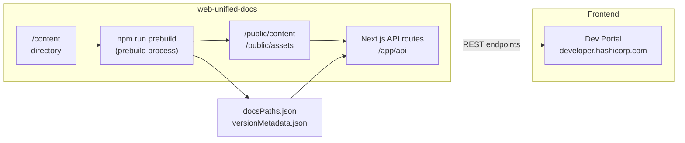

This page explains the high-level architecture of `web-unified-docs`: how content is stored, processed, and served to the dev-portal frontend.

## Content flow overview



1. Documentation content is authored in the `/content` directory.
2. The prebuild process (`npm run prebuild`) transforms that content into processed files in `/public`.
3. The Next.js API routes in `/app/api` read from `/public` and serve content to the dev-portal via REST endpoints.

## The two API systems

During the migration period, Dev Portal sources content from two APIs:

<CardGroup cols={2}>
  <Card title="Content API" icon="database">
    **content.hashicorp.com** — the existing system. Sources documentation directly from individual product repositories. Powered by `hashicorp/mktg-content-workflows`.
  </Card>
  <Card title="Unified Docs API" icon="layer-group">
    **This repository** — the new system. Sources documentation from the `/content` directory. Will eventually replace the content API entirely.
  </Card>
</CardGroup>

As products migrate to this repository, their documentation is served by the unified docs API instead of the legacy content API.

## Directory structure

```text
web-unified-docs/
├── content/                # All product documentation content
│   ├── boundary/           # Versioned product
│   │   ├── v0.17.x/
│   │   └── v0.18.x/
│   ├── hcp-docs/           # Unversioned product
│   └── terraform/          # Versioned product
│       ├── v1.8.x/
│       └── v1.9.x/
├── app/
│   └── api/                # Next.js API route handlers
│       ├── all-docs-paths/ # GET /api/all-docs-paths
│       ├── assets/         # GET /api/assets/[productSlug]/[version]
│       ├── content/        # GET /api/content/[productSlug]/doc/[version]/[...path]
│       ├── content-versions/   # GET /api/content-versions
│       └── supported-products/ # GET /api/supported-products
├── scripts/                # Prebuild, migration, and utility scripts
├── docs/                   # ADRs, content guides, and workflow docs
├── public/                 # Generated output — do not edit manually
│   ├── assets/             # Processed image assets per product/version
│   └── content/            # Processed MDX content per product/version
└── productConfig.mjs       # Per-product configuration
```

## The prebuild process

Before the API can serve content, the prebuild step must run. Inside the Docker container this happens automatically on startup. For local development outside Docker, run it manually:

```shell-session
npm install
npm run prebuild
```

The prebuild process does the following:

1. **Processes content** — reads MDX files from `/content` and writes processed versions to `public/content`.
2. **Processes assets** — copies image assets from `/content` into `public/assets`, organized by product and version.
3. **Generates `docsPaths.json`** — a flat list of all known documentation paths, written to `app/api/docsPaths.json`. Used by the `/api/all-docs-paths` endpoint.
4. **Generates `versionMetadata.json`** — version metadata for all versioned products, written to `app/api/versionMetadata.json`. Used by the `/api/content/[productSlug]/version-metadata` endpoint.

<Warning>
  The `public/` directory is generated output. Do not manually edit files in `public/content` or `public/assets` — your changes will be overwritten the next time `npm run prebuild` runs.
</Warning>

## Versioning approach

Unified docs uses **directory-based versioning** instead of the historic git branch and tag strategy.

Each versioned product has a subdirectory per supported version:

```text
content/terraform/
├── v1.7.x/
├── v1.8.x/
└── v1.9.x/
```

This means:

- You can update documentation for multiple versions in a single PR — just edit the files in the relevant version directories.
- Finding and applying the same change across versions is a simple find-and-replace on the filesystem.
- There is no need to cherry-pick commits across branches.

### Version metadata

The prebuild process collects version metadata by scanning the version subdirectories in each product's content folder. The `productConfig.mjs` file provides a `semverCoerce` function per product that normalizes version strings for sorting. Terraform Enterprise, for example, uses date-based version strings (`v202206-01`) rather than semver, so its `semverCoerce` function converts those to sortable semver values.

## The Next.js API routes

All API routes live in `/app/api` and are implemented as Next.js Route Handlers. They serve the dev-portal and any other consumers that need documentation content.

| Route | Description |
|---|---|
| `GET /api/all-docs-paths` | Returns all known documentation paths across all (or a filtered set of) products. Used by dev-portal to build its routing table. |
| `GET /api/content/[productSlug]/doc/[version]/[...path]` | Returns the processed MDX content and metadata for a specific doc page. |
| `GET /api/content/[productSlug]/nav-data/[version]/[...section]` | Returns navigation sidebar data for a product version. |
| `GET /api/content/[productSlug]/version-metadata` | Returns available versions and version metadata for a product. |
| `GET /api/content/[productSlug]/redirects` | Returns redirect rules defined in a product's content directory. |
| `GET /api/assets/[productSlug]/[version]/[...path]` | Serves image and other static assets for a product version. |
| `GET /api/content-versions` | Returns the versions in which a specific document exists. |
| `GET /api/supported-products` | Returns the list of all product slugs currently supported by the unified docs API. |

<Note>
  The unified docs API is designed as a drop-in replacement for the existing content API at `content.hashicorp.com`. Routes are intentionally compatible with the existing API contract so the dev-portal can switch between them without frontend changes.
</Note>
