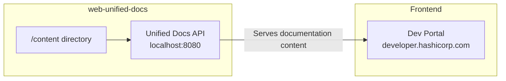

HashiCorp Web Unified Docs (`web-unified-docs`) is the single source of truth for all HashiCorp product documentation. It consolidates documentation from across all product repositories into one place, making it dramatically easier to contribute, version, and maintain docs at scale.

<CardGroup cols={2}>
  <Card title="Quickstart" icon="rocket" href="/quickstart">
    Get a local preview running in minutes using Docker.
  </Card>
  <Card title="Architecture" icon="diagram-project" href="/architecture">
    Understand how the unified docs API, content repository, and dev-portal connect.
  </Card>
  <Card title="Contributing" icon="code-pull-request" href="/contributing/overview">
    Learn how to contribute documentation updates and new content.
  </Card>
  <Card title="API Reference" icon="code" href="/api/overview">
    Explore the REST API endpoints that serve documentation to the dev-portal.
  </Card>
</CardGroup>

## Why unified docs?

Before this project, HashiCorp documentation lived in individual product repositories — each with its own release workflow, branching strategy, and content API integration. This created friction for contributors and made platform-level changes (like updating MDX versions or rewriting URLs) extremely difficult.

The unified docs repository solves this by:

<CardGroup cols={2}>
  <Card title="One repo, all products" icon="layer-group">
    All versioned documentation lives in the `content/` directory, organized by product and version.
  </Card>
  <Card title="Simplified versioning" icon="code-branch">
    Version directories on the filesystem replace the old branch/tag strategy — update all versions in a single PR.
  </Card>
  <Card title="Faster contributions" icon="bolt">
    Find and fix content across all versions at once with simple find-and-replace across the filesystem.
  </Card>
  <Card title="Reliable publishing" icon="shield-check">
    No more missed GitHub events or out-of-date docs — re-run the publishing process any time something goes wrong.
  </Card>
</CardGroup>

## Products in this repository

The following HashiCorp products have their documentation hosted here:

| Product | Directory | Versioned |
|---|---|---|
| Boundary | `content/boundary` | Yes |
| Consul | `content/consul` | Yes |
| HCP | `content/hcp-docs` | No |
| Nomad | `content/nomad` | Yes |
| Packer | `content/packer` | Yes |
| Sentinel | `content/sentinel` | Yes |
| Terraform | `content/terraform` | Yes |
| Terraform CDK | `content/terraform-cdk` | Yes |
| Terraform Enterprise | `content/terraform-enterprise` | Yes |
| Terraform Plugin Framework | `content/terraform-plugin-framework` | Yes |
| Terraform Plugin SDK | `content/terraform-plugin-sdk` | Yes |
| Terraform Plugin Testing | `content/terraform-plugin-testing` | Yes |
| Vault | `content/vault` | Yes |
| Well-Architected Framework | `content/well-architected-framework` | No |

## How it works

Content in the `content/` directory is processed at build time into the `public/` directory. The Next.js API routes then serve that content to the dev-portal frontend.

<Note>
  Updates to the `main` branch appear on [developer.hashicorp.com](https://developer.hashicorp.com) within approximately 30 minutes.
</Note>
