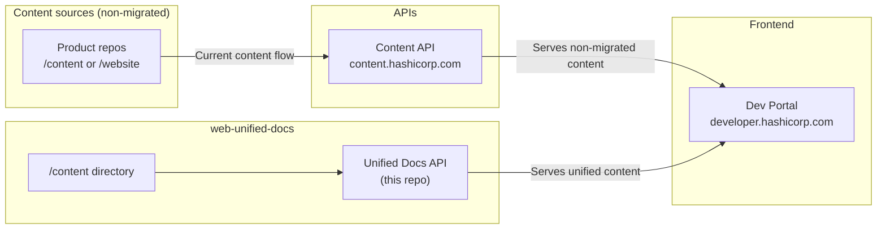

`hashicorp/web-unified-docs` is the unified documentation repository and API for all HashiCorp product documentation. It consolidates content that previously lived in dozens of separate product repositories into a single repo, making it dramatically simpler to contribute, version, and maintain docs at scale.

Published changes appear on [developer.hashicorp.com](https://developer.hashicorp.com) within approximately 30 minutes of merging to `main`.

## Why it exists

Before this project, HashiCorp documentation lived in individual product repositories — each with its own release workflow, branching strategy, and content API integration. This created friction for contributors and made platform-level changes extremely difficult.

The Unified Product Documentation Repository RFC set the broad direction: consolidate all documentation into one branch of one repository, and build an API that serves it to the existing dev-portal frontend.

## Key benefits

<CardGroup cols={2}>
  <Card title="One repo, all products" icon="layer-group">
    All versioned documentation lives in the `content/` directory, organized by product and version. No more hunting across repos.
  </Card>
  <Card title="Simplified versioning" icon="code-branch">
    Version directories on the filesystem replace the old branch-and-tag strategy. Publish changes to multiple versions in a single PR.
  </Card>
  <Card title="Find and fix at scale" icon="magnifying-glass">
    All versioned docs are on the filesystem at once, so a single find-and-replace covers every version of every product.
  </Card>
  <Card title="Reliable publishing" icon="shield-check">
    No missed GitHub webhook events. If something goes wrong in the publishing process, run it again instead of waiting for an incoming event.
  </Card>
  <Card title="Platform-level changes" icon="wrench">
    Updates like migrating to MDX v2 or rewriting URL patterns can be applied across the entire documentation corpus in one PR.
  </Card>
  <Card title="Fully versioned previews" icon="eye">
    PR preview environments include all doc versions, not just the branch being modified.
  </Card>
</CardGroup>

<Note>
  Adding a new product is as easy as creating a new folder in `content/`. No API-side code changes or GitHub App installations required.
</Note>

## How it fits into the ecosystem

The repository serves as one of two content sources for the Dev Portal (`dev-portal`), the frontend that powers `developer.hashicorp.com`.

- **Content API** (`content.hashicorp.com`) — the existing system that sources documentation from individual product repositories. Powered by [hashicorp/mktg-content-workflows](https://github.com/hashicorp/mktg-content-workflows).
- **Unified Docs API** (this repo) — the new system that sources documentation from the `/content` directory in this repository. Will eventually replace the content API entirely.
- **Dev Portal** — the frontend application. Sources content from both APIs during the migration period.

## Quick links

<CardGroup cols={2}>
  <Card title="Quickstart" icon="rocket" href="/quickstart">
    Get a local preview running in minutes using Docker.
  </Card>
  <Card title="Architecture" icon="diagram-project" href="/architecture">
    How content flows from the `/content` directory to the dev-portal.
  </Card>
  <Card title="Contributing" icon="code-pull-request" href="/contributing/overview">
    How to submit documentation changes and new content.
  </Card>
  <Card title="API Reference" icon="code" href="/api-reference">
    The REST endpoints that serve documentation to the dev-portal.
  </Card>
</CardGroup>
